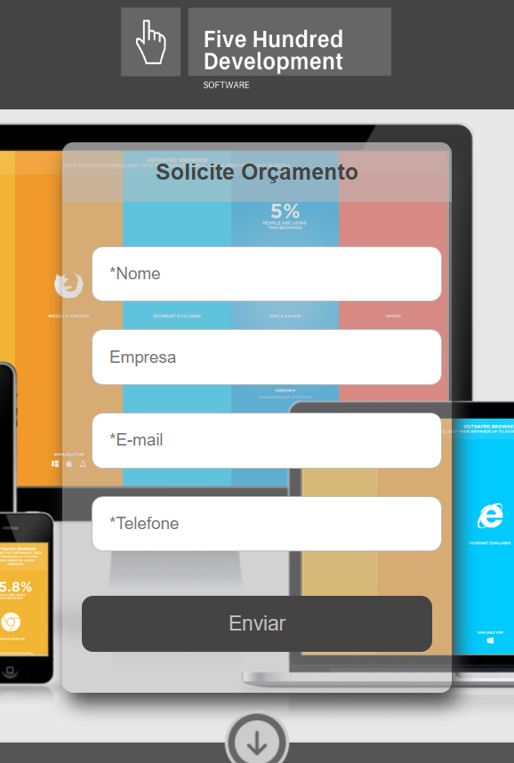

## Modelo-Landing-Page-FiveHundred
### Web
---

 

### Mobile
---

#### Sobre:
---
O site é uma landing page responsiva e simples, desenvolvida com objetivo de praticar conceitos básicos de: 

- HTML;
- CSS;
- JavaScript. 

O projeto foi feito durante o curso **[Front End Completo - Danki Code]( https://cursos.dankicode.com/curso-front-end-completo)**, porém foi idealizado pensando em uma empresa fictícia chamada [Five Hundred](#-fivehundred).

#### Five Hundred
É uma empresa fictícia criada durante a faculdade por mim e por outros três colegas, para realizarmos alguns trabalhos durante o período do curso e para projetos externos.

